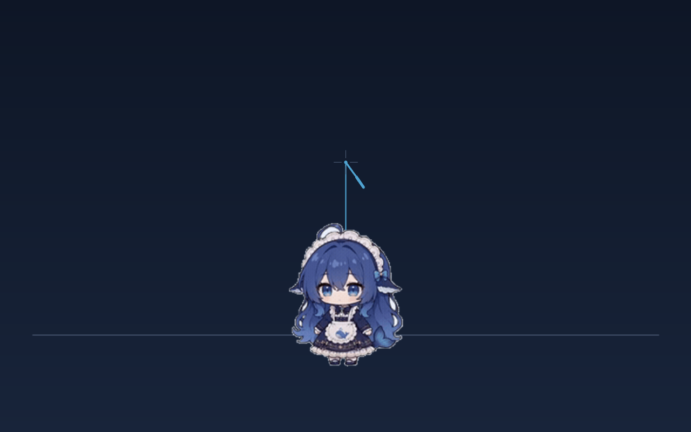

# 🎣 dsh-whale-rod-cursor · 鱼竿鲸鱼娘光标

[](https://dsh-plugin.org/plugins/xingheyewang-1/dsh-whale-rod-cursor)
[](LICENSE)

**一句话价值**：把你 DSH Web 界面里那个冷冰冰的系统光标，换成一根鱼竿 ——
线上吊着只 Q 版鲸鱼娘，你甩鼠标她就跟着飞，悬停输入框会变色，鼠标一停她还自己演"钓鱼佬又空军了"的小剧场。

一个挂在 **DeepSeek Harness Web 界面**上的小玩具插件：

> **鼠标位置 = 鱼竿竿尖**（默认直接把系统光标换成鱼竿），一条**带弹性的绳**
> 吊着 **Q 版鲸鱼娘（当鱼饵）**。鼠标一动，她被**猛拽 → 甩飞出去 → 荡几下收回来**；
> 甩猛了会冒萌语气泡（**字随力度变大，最猛时和鲸鱼娘一样大**），
> 安静下来还会补一句求饶/卖萌/生气的台词。
> 她还会**跟着 DSH 的干活状态换姿态**：平时 / 在忙 / 干完了。
> 悬停输入框 / 按钮 / 按下鼠标时，鱼竿会**变色**，让你用余光就知道"现在点得到什么"。

当前版本：**v8**（`__WHALE_ROD_CURSOR_VER__ = '2026-09-15-v8-swingbubble'`，包版本 0.1.2）

---

## 一、它长什么样

```
   ╲  ← 竿尖钉在鼠标位置（箭头光标同朝向：竿身往右下拖）
    ╲
     │      ← 弹性绳（会随甩动拉长/回缩）
     │
    (🐳)    ← Q 版鲸鱼娘 = 鱼饵（猛拽、甩飞、Q 弹形变、荡几下收回）
     💬 "杀鲸啦！"
```

- **竿子朝向**：竿尖在**左上**、竿身朝**右下**延伸 —— 和系统箭头光标同一个朝向（v3 修正，v2 是倒着拿的）
- **尺寸**：整体 `0.72` 倍（v3 缩小一档），鱼竿与挂件一起缩；设置页可 0.5–1.2 调
- 鱼饵**沿绳方向旋转**（最多 ±58°，不会翻跟头）
- **Q 弹形变**：阻尼余弦振荡 `amp = A·e^(-t/τ)`，压缩/拉伸绕角色中心发生
- **绳末端严格接在她头顶**：挂点不是画布中心，而是**构建期用 jimp 扫 alpha 量出来的**
  "画布中线往下第一个实体像素"（当前素材是 `(72,10)`；画布顶端到那儿有 8px 透明留白）。
  Q 弹压缩的支点也改成"内容中心"。换素材只需重跑 `node build.cjs`，不用手改任何常数。

## 一·五、姿态包：平时 / 在忙 / 干完了（v6 新增）

三张姿态图都已抠好（都是上游 MIT 素材，声明见 `NOTICE.md`），构建期为**每张**分别量挂点：

| 姿态 | 素材 | 尺寸 | 挂点 | 什么时候用 |
| --- | --- | --- | --- | --- |
| `idle` 平时 | `keyed-idle.png` | 144×180 | (72,10) | 默认 |
| `work` 在忙 | `keyed-work.png` | 159×180 | (80,9) | DSH 正在跑 / 或被甩得手忙脚乱 |
| `done` 干完了 | `keyed-done.png` | 160×180 | (80,9) | 跑完了，停留 2.5 秒（可调） |

**两种驱动来源**（设置页一键切）：

- **跟着 DSH 状态（默认）**：读官方客户端服务 `ctx.get('sessions')` 的列表快照
  `{ current, byId }`，取当前会话那一行的 `running` 布尔值 —— 在跑 → `work`；
  跑完 → `done` 停 2.5s → 回 `idle`。订阅 + 800ms 轮询兜底，状态一变就跟上。
  **服务读不到（版本差异）时自动退化成"跟着甩动"，而且不会报错。**
- **跟着甩动**：被甩飞 → `work`（手忙脚乱）；荡稳了 → `done`（喘口气）→ `idle`。

**性能**：三张图都内嵌成三个 `<image>`，切换只改 `display` —— 不重新解码、不闪烁、
**每帧零开销**（只在状态真变了才动一次）。代价是 client.js 从 126.8 KB 涨到 317.9 KB
（多约 180 KB base64，一次性解析；鼠标路径完全不受影响）。
将来若嫌包大，可以像桌宠那样改成宿主路由 `GET /whale-rod/pose/<name>.png` 按需懒加载。

## 二、手感：猛拽 → 甩飞 → 荡几下收回（v4 换回低阻尼）

递进刚度 + **常数阻尼**（阻尼小才有甩飞感）：

```
k_eff = k_soft + k_yank · clamp(|v_rel| / 1600, 0, 1)      ← 甩得越猛，绳子越"硬"
F     = -k_eff·(绳长差)·方向 - c·v_rel + 重力              ← c 是常数（默认 2.6）
v    *= e^(-λ·dt)          （半隐式欧拉积分）
```

实测曲线（冒烟测试 `[7]` 每次都会重新量一遍）：

| 阶段 | 数值 |
| --- | --- |
| 静息悬挂 | 鼠标下方 **83px**（绳长 62 + 重力沉降 21） |
| 猛拽 600px 的瞬间 | 距离拉到 **538px** —— 初始拉力极大 |
| 之后 | **416 → 228 → 444 → 333 → 42 → 97 → 85 → 83px** —— 荡出去最远 **481px（静息的 5.8 倍）**，这就是"甩飞" |
| 匀速拖拽 1200px/s | 只拖出 **82px** 尾巴 —— 匀速时仍跟手 |
| 极端甩 1500px | 峰值 1323px，照样收回 **83px**，不失控飞走 |

> 想要"乖乖滑回来"就把设置里的「阻尼」调大（8 就基本不荡了）；想要更疯就调小。

## 三、颜色 = 可交互性提示

| 状态 | 颜色 | 含义 |
| --- | --- | --- |
| 默认 | 深海青蓝 `#4FA3D1` | 安静待着 |
| 悬停输入框 / 可编辑区 | 亮青绿 `#5FE3B0` | 这里可以打字 |
| 悬停按钮 / 链接 | 淡金 `#F2B23E` | 这个能点 |
| 按下鼠标 | 橙红 `#F2603E`（闪 150ms） | 点到了 |

判定用 `closest('textarea, input, [contenteditable]')` 与 `closest('button, a, [role=button]')`，
**不写死任何 DSH 的 class 名**，界面改版也不会失效。

因为"能不能点 / 能不能打字"都画在鱼竿上了，所以**藏掉系统光标也不丢信息**。

## 四、两种光标模式

| 模式 | 行为 | 说明 |
| --- | --- | --- |
| **鱼竿当光标**（默认） | `html, html * { cursor: none }`，鱼竿**钉**在鼠标位置 | 竿尖严格跟手、零延迟；鱼竿本身就是光标 |
| 真光标 + 拖挂 | 系统光标照常显示，鱼竿挂在旁边 | 光标语义（I 型等）原样保留 |

**应急出口**：按 **Alt+Esc** 一键在两种模式间切换（万一找不到鼠标了）。
另外还有三条安全网：窗口失焦 / 鼠标离开窗口 / 标签页隐藏 / 组件卸载或渲染出错 —— 任一情况**立即恢复系统光标**。

## 五、气泡：触发看加速度 + 甩飞速度，字号看力度（v3 触发 / v4 字号 / v8 触发搬进物理循环）

两条触发线并行，**谁大用谁**：

```
① 事件线（mousemove）：sp = 移动速度(px/s)、acc = 速度变化率(px/s²) = 瞬时加速度
② 物理线（每帧）：    relSp = |她与鼠标的相对速度|   ← 抓"被拽飞"和"惯性滑行"
```

- **力度** = `max(acc / 加速度阈值, relSp / 甩飞阈值)`；> 1 就冒泡
- **甩得越猛 → 冷却越短 → 冒泡越勤**（下限 0.7s，防刷屏）
- **字号随力度长大**：`13px × 力度^1.25`，封顶 ≈ **鲸鱼娘的身高**（0.72 倍时约 121px）
  —— 所以最猛那一下的气泡能跟她一样大；气泡的 padding/边框都是 `em`，整颗泡泡一起长大；
  长句（比如「别甩啦别甩啦，我求饶还不行吗——」）会按字数自动收一点，免得顶出屏幕
- **力度 ≥ 3 倍阈值 → 尖叫池（13 条）**，三种口味随机：
  - 纯尖叫：「啊啊啊啊啊——」「呜哇啊啊啊啊——」
  - **求饶**：「求你了别甩了呜呜呜——」「我错了我错了！放我下来——」「钓鱼佬饶命啊——」「我招了！我承认我是条鱼——」
  - **哭唧唧**：「呜呜呜我要吐了——」「哭给你看！呜呜呜呜——」「呜——我的呆毛要飞了——」「呜呜……我再也不偷吃 Token 了——」
- **平静之后补台词**：被甩完安静下来（相对速度 <150px/s 持续 0.7s，且距上次说话 >停留时长），
  补一句**求饶 / 卖萌 / 生气**（默认 10 条），停留 2–3 秒（默认 2.6s，可调）；每次"被甩"只补一句，不啰嗦
- 抗噪三件套：dt 下限 8ms（160Hz 高刷鼠标的单像素抖动会被放大成几万 px/s²）、
  速度先做 EMA 再求导、加速度再做 EMA；停顿 >150ms 后把基准归零（当作从静止起步，抽鞭照样抓得住）

### v8：气泡触发搬进物理循环（修"被甩飞却没气泡"）

**bug 现场**：她明明被甩出去老远，却一声不吭；反而**切回窗口**时蹦一个巨大尖叫。

**原因（三条都指向同一个错**：触发点放在了错误的地方）：

| 现象 | 原因 |
|---|---|
| 匀速快拖 → 没气泡 | 老逻辑只在 `mousemove` 里、**只看加速度**；匀速拖动速度大但加速度≈0，阈值永远碰不到 |
| 飞出去那半秒完全没气泡 | **鼠标停了就没有 `mousemove` 事件** —— 而她"被甩飞"恰恰发生在鼠标停之后的惯性滑行段，那段压根没有检查在跑 |
| 切回窗口反而尖叫 | 指针瞬移进窗口 + 基准归零 → 算出个假的"天大加速度" |

**修法**：

- 触发搬进**物理循环**（每帧都跑），强度用「**她与鼠标的相对速度**」`relSp`
  —— 这才是"被甩得多猛"的物理真相，匀速拖拽与惯性滑行两段全覆盖；
  加速度那条（猛一顿 / 猛一停）保留，**两条谁大用谁**
- 新增设置项「**甩飞灵敏度**」（默认 1400 px/s）；原来的「甩动灵敏度」仍是加速度阈值
- 指针重新进窗口（`focus` / `mouseenter`）时：**趁她还隐身，直接吸附到新锚点**，
  既不会被假猛拽甩飞，也不会冒出一声莫名其妙的尖叫（位置一帧内不跳，因为她本来就不可见）

回归测试（`[4.8]`）：匀速快拖 3300px/s → 拖动中冒 28px 泡；**停手后（零 `mousemove`）惯性滑行期再冒 19px 泡** ✔

### v8：绳子在 Q 弹形变中也不会脱钩

形变是绕「内容中心」压缩的，所以头顶会随形变上/下移动（峰值可达 32px）。
以前绳末端死钉在锚点上 → 甩起来的瞬间会看起来"绳子跟头脱开了"。
现在绳末端（和气泡位置）按**同一套变换**算出"形变后的头顶"，两者永远重合：

```
静置时误差        0.000px
Q 弹形变中误差    0.01px    （按下鼠标触发形变后实测）
```

## 五·五、闲置小剧场（v7 新增）

鼠标**停下来**（默认 6 秒）她就自己开演，台词池 **20 条**，主题围绕
**吊鲸鱼 / 钓鱼佬 / 空军** —— 一半嘲讽、一半卖萌：

> 「钓鱼佬今天又空军了吧～」「空军司令您好，敬礼！」「你把鼠标当鱼漂甩，钓得到才有鬼」
> 「钓我？先准备一吨小鱼干再说」「要不要我给你咬一口？就一口哦」「本鲸鱼今天心情好，允许你摸一下头」

- 台词间隔默认 7 秒，**不会连着重复**（记住最近说过的 5 条）
- 优先级：尖叫 > 平静台词 > 小剧场 —— 三者共用"上次说话时刻"闸门，永远一句一句、不抢麦
- **DSH 在干活时不插嘴**（work 姿态期间闭嘴，专心当"在忙的鲸鱼"）
- 鼠标一有动静就停演，重新计时
- 池子可在设置页随便改（一行一条）；不喜欢就一键关掉

## 六、它**不会**妨碍你做事

- 整层 `pointer-events: none` —— 点击、选中、拖拽、快捷键全部照常
- 每帧只写 `transform` 与 SVG 坐标属性，**不碰任何布局属性**，不会引起重排
- 标签页隐藏时暂停 rAF
- 套了**渲染错误围栏**：即使出错也只显示一行红字，绝不把异常抛给框架（避免整块 overlay 被卸载），并且**顺手把光标还回去**

## 七、安装

**从插件市场 / npm（发布后可用）**：

```bash
# 认准 profile：本插件是 Web 端插件，profile 用 web
dsh plugin --profile web add dsh-whale-rod-cursor
```

**从 GitHub 源码安装**：

```bash
dsh plugin --profile web add git+https://github.com/xingheyewang-1/dsh-whale-rod-cursor.git
```

> 装完**必须重启 `dsh web`**（客户端 bundle 是启动时进内存缓存的，只刷新页面不够），
> 然后硬刷新页面。仓库里已经带了构建好的 `lib/client.js`，**不需要任何构建步骤与授权**。

**本地开发版安装**（本机就是这条）：

```powershell
# 一条命令搞定（幂等，可反复跑）
node H:\DSH_Workspace\tools\dsh-whale-rod-cursor\install-to-profile.mjs

# 它会做三件事：
#   1. 复制插件到 ~/.dsh/plugins/dsh-whale-rod-cursor
#   2. 复制插件到 ~/.dsh/profiles/web/node_modules/dsh-whale-rod-cursor
#   3. 备份并在 ~/.dsh/profiles/web/cordis.patch.yml 末尾追加 insert 条目
```

⚠️ **必须重启 `dsh web`**（客户端 bundle 是启动时进内存缓存的，硬刷新不够）。
重启后**硬刷新**页面，控制台输入：

```js
__WHALE_ROD_CURSOR_VER__     // 应输出 '2026-09-15-v7-theater'
```

看到这个版本戳 = 新代码真的生效了。看不到 = 还在跑老 bundle。

### 安装前的"信任信号"（插件市场收录要求）

| 项 | 说明 |
| --- | --- |
| 支持 profile | **`web`**（`dsh.client.platform: 'web'`）。终端 TUI 不受影响，装不装都不影响命令行 |
| 需要的 DSH 版本 | 客户端插件规范：`@deepseek-ai/cordis ^4.0.1`、`@deepseek-ai/dsh-client-runtime ^0.1.0-rc.6`（peer） |
| 权限 | **无网络、无文件访问、无外部服务**。只做三件事：往 `<head>` 插一段 CSS、在 `shell.overlay` 画 SVG 装饰层、读 `localStorage` 存自己的设置 |
| 唯一"有副作用"的行为 | 默认模式会隐藏系统光标（`html * { cursor: none }`），并给出四条恢复路径：**Alt+Esc**、窗口失焦、鼠标离开窗口、卸载/渲染出错 |
| 读取的 DSH 内部状态 | 只读 `ctx.get('sessions')` 的列表快照里当前会话的 `running` 布尔值（判断"在忙/干完"）。读不到就自动退化，不影响功能 |
| 遥测 | 无。不发送任何数据 |
| 卸载 | `dsh plugin --profile web remove dsh-whale-rod-cursor` + 重启 `dsh web` |

### 预览



> 上图是**程序绘制的示意图**（`node tools/make-preview.cjs` 生成），不是真机截图 ——
> 真机截图见 `assets/preview/screenshot.png`（欢迎 PR 补充，Win+Shift+S 即可）。

> **⚠️ 一个坑（重要）**：本插件是**手工放进 `node_modules`** 的，没有写进 profile 的
> `package.json` dependencies（桌宠 `dsh-whale-girl-pet` 才是靠 npm 装的）。
> 所以如果你哪天在 profile 目录里跑 `pnpm install` / `pnpm prune`，
> pnpm 可能把"不在依赖表里的目录"当垃圾清掉 —— 鱼竿会突然消失。
> 届时重跑一次 `install-to-profile.mjs` 即可复原。

## 八、设置（DSH 设置 → 🎣 鱼竿光标）

| 项 | 默认 | 说明 |
| --- | --- | --- |
| 启用 | 开 | 想清静时一键关掉（关掉会立刻还回系统光标） |
| 光标模式 | 鱼竿当光标 | 见第四节；也可 Alt+Esc 切 |
| 整体尺寸 | 0.72 | 鱼竿 + 挂件一起缩放 |
| 姿态包 | 开 | 关掉就永远只用 `idle` |
| 姿态来源 | 跟着 DSH 状态 | 或「跟着甩动」；服务读不到会自动退化 |
| "干完了"停留 | 2.5 s | done 姿态显示多久（0.8–8s） |
| 小剧场 | 开 | 鼠标停下自己开演（吊鲸鱼/钓鱼佬/空军） |
| 停下多久开演 | 6.0 s | 2–60s |
| 台词间隔 | 7.0 s | 2.5–60s，不连着重复 |
| 绳长 | 62 px | 绳的自然长度 |
| 软跟随刚度 | 70 | 静止时只剩它 → 越大气氛越"紧" |
| 瞬间拉力 | 320 | 甩动时额外刚度 → 初始拽力极大 |
| 阻尼 | 2.6 | **小 = 甩得飞、甩完还荡；大 = 乖乖滑回来**（8 基本不荡） |
| 指数衰减 | 1.2 | 绝对阻尼 λ |
| 重力 | 1.00 | 沉降量 ≈ `g/k` |
| 甩动灵敏度 | 45k | 鼠标瞬时加速度阈值（px/s²）—— 抓"猛一顿 / 猛一停" |
| **甩飞灵敏度** | **1400 px/s** | **她与鼠标的相对速度阈值** —— 抓"被拽飞 / 惯性滑行"（v8 新增） |
| 气泡冷却上限 | 4.5 s | 实际冷却 = 上限 ÷ 甩动强度（下限 0.7s） |
| 气泡语录 | 10 条 | 一行一条，改完立即生效 |
| 尖叫语录 | **13 条** | 力度超阈值 3 倍时专用（纯尖叫 / 求饶 / 哭唧唧三味），**字号能长到和鲸鱼娘一样大** |
| 平静台词停留 | 2.6 s | 求饶/卖萌/生气台词的显示时长（2–3 秒） |
| 平静台词 | 10 条 | 被甩完安静下来时补一句 |
| 小剧场台词 | 20 条 | 吊鲸鱼 / 钓鱼佬 / 空军；鼠标停下时轮播 |

## 九、开发

```powershell
cd H:\DSH_Workspace\tools\dsh-whale-rod-cursor

# build 会逐张现量素材挂点（jimp 扫 alpha）→ 注入 __WHALE_POSES__ → 存档 lib/whale-anchor.json
node build.cjs      # lib/client.src.js --(注入三张素材 + 各自挂点)--> lib/client.js（并留 lib/client.js.prev 回滚点）
node --check lib\client.js
node smoke-test.cjs # 106 项冒烟测试
```

**改逻辑请改 `lib/client.src.js`**，不要直接改 `lib/client.js`（每次 build 都会覆盖它）。

`smoke-test.cjs` 用最小的假 DOM + 假 React 把 bundle 真跑一遍，并手动泵 rAF 帧验证行为：

1. 模块加载协议 / 插件三件套
2. **挂点链条**：三张素材各自的 sha256 → `whale-anchor.json` → 产物里注入的 `__WHALE_POSES__` 三者必须一致
3. 两个插槽注册（外壳 overlay + 设置页）
4. 几何：竿尖在 (0,0)、握把朝右下、**每张姿态的绳末端都落在她头顶那一像素上**（自写 SVG 变换求值器，精确到 0.001px）
5. **姿态包**：三张图都挂着且只有一张可见；喂一个**假的 DSH sessions 服务**（`{current, byId:{s1:{running}}}`）
   验证 在跑→work、跑完→done、2.5s 后→idle；再点设置页的「跟着甩动」按钮验证另一条驱动路径
6. 物理：倾角夹在 ±58°、静止回落、吊线无 NaN
7. 气泡：缓甩小字萌语 → 暴甩尖叫（字号顶到鲸鱼身高）→ 平静后补求饶/卖萌/生气
8. **手感曲线**：猛拽峰值 → 甩飞最远距离 → 收敛到静息悬挂 → 极端甩动不失控
9. 保命：Alt+Esc 还光标、卸载后光标仍可见

> 它抓到的真 bug：`factory` 忘了 `return module.exports`（插件会被静默判定为"没有导出"）、
> 页面刚打开头几秒气泡被冷却时间误伤、v3 首版阻尼太大导致"甩不飞"（用户体感反馈）、
> 鲸鱼娘变换里**缩放挂错锚点**导致头顶被抬高 25px，
> 以及画布顶端到头顶的**透明留白**让绳末端悬在半空（只能靠量像素发现，肉眼看代码永远看不出来）。
> 姿态包这轮它自己也踩了一次：`work`/`done` 挂点相同，测试一开始只按挂点认人 → 把两张认成同一张，
> 改成"尺寸 + 挂点"一起认才对。

## 十、已知边界 / 未来可做

- 姿态只有 idle / work / done 三张。上游还有上百个 WebM 动作，想要"生气/开心/惊慌"这类**情绪**姿态得另找素材 + 走一遍声明流程
- 目前是静态 PNG。想做**动画**（透明 WebM）得再走一遍素材声明流程，并且要考虑解码开销
- 三张姿态都内嵌在 client.js 里（317.9 KB）。想瘦身就改成宿主路由懒加载
- 只作用于 Web 界面（`platform: 'web'`），不影响终端 TUI
- 藏系统光标是"整站生效"的：DSH 界面里若有个别控件自带特殊光标，也会被一起藏掉（鱼竿会替它变色）

## 十一、出处与授权

见 **`NOTICE.md`**。简短版：

- Q 版鲸鱼娘形象来自 [`yanzwzz/dsh-whale-girl-pet`](https://github.com/yanzwzz/dsh-whale-girl-pet)（MIT），
  由星河野望从预览 GIF 首帧抠图 + 缩放加工
- Q 弹振荡 / 阻尼 / 重力的**取值基准**参考社区插件 `dsh-think-bounce-pet`（作者 9livewolf，声明 MIT），
  **只借公式与常数，未复制其任何代码或界面**

本插件以 MIT 发布。**这是社区作品，与 DeepSeek 官方无隶属关系**（名字里带 `dsh-` 只是遵循社区命名习惯）。
